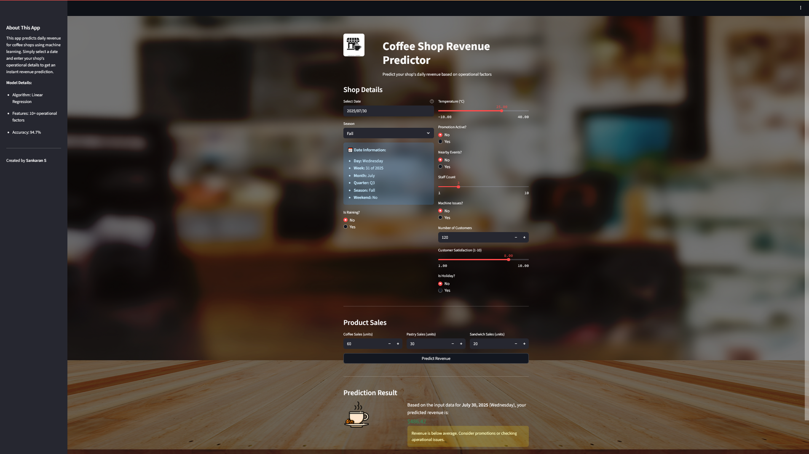

# ☕ Coffee Shop Revenue Predictor


A simple web app that helps coffee shop owners predict their daily sales using machine learning.



**[Live Demo - Try it here!](https://coffee-shop-revenue-predictor.onrender.com)**

## What This Project Does

Coffee shop owners never know how much money they'll make each day. This makes it hard to:

- Plan how many staff to schedule
- Know how much food to prepare
- Decide when to run promotions
- Manage daily cash flow

My app solves this by predicting tomorrow's revenue based on simple inputs like weather, date, staff count, and expected sales.

## How It Works

**Input your details:**

- Pick a date from calendar
- Enter weather info (temperature, rain)
- Add operational details (staff count, promotions)
- Estimate product sales (coffee, pastries, sandwiches)

**Get instant prediction:**

- Shows predicted revenue amount
- Gives advice (good day, slow day, etc.)
- Helps plan staffing and inventory


## Key Features

- **Easy date picker** - Just click calendar instead of entering complex date info
- **Weather consideration** - Accounts for rain and temperature effects
- **Staff planning helper** - See if you need more or fewer staff
- **Promotion insights** - Test if promotions will boost revenue
- **Clean interface** - Simple design anyone can use


## The Machine Learning Model

**Performance:**

- Trained on 292 coffee shop records
- 94.7% accuracy in predictions
- Average error: only \$25
- Most important factor: Coffee sales volume

**What it considers:**

- Day of week and season
- Weather conditions
- Staff count and operational issues
- Customer satisfaction
- Product sales numbers


## Technologies Used

- **Python** - Main programming language
- **Streamlit** - Web app framework
- **Machine Learning** - Scikit-learn for predictions
- **Deployment** - Hosted on Render with GitHub


## Project Structure

```
├── app.py                 # Main web application
├── coffee_sales_model.pkl # Trained model file
├── scaler.pkl            # Data processing file
├── feature_selector.pkl  # Feature selection file
├── requirements.txt      # Required packages
└── README.md            # This file
```


## How to Run Locally

1. Download the project files
2. Install Python packages: `pip install -r requirements.txt`
3. Run the app: `streamlit run app.py`
4. Open web browser to see the app

## Real Business Value

**For coffee shop owners:**

- Save money on unnecessary staff
- Reduce food waste
- Make better promotion decisions
- Plan cash flow more accurately

**Example:**
Predict Saturday will be busy (\$8,450 revenue) → Schedule 4 staff instead of 2 → Better customer service → Actually hit revenue target

## What I Learned

**Technical skills:**

- Building complete machine learning projects
- Creating user-friendly web apps
- Deploying projects to the cloud
- Working with real business data

**Business skills:**

- Understanding small business challenges
- Creating solutions people actually need
- Measuring real impact on profits
- Designing for non-technical users


## Future Improvements

- Add more detailed analytics
- Connect with weather APIs for automatic updates
- Support multiple coffee shop locations
- Add mobile phone optimization
- Include seasonal trend analysis


## ✉️ Contact

**Sankaran S**  
[](https://github.com/sankaran-s2001)  
[](https://www.linkedin.com/in/sankaran-s21/)  
[](mailto:sankaran121101@gmail.com)

---

*This project shows how data science can solve real problems for small businesses. Built to help coffee shop owners make smarter decisions with their daily operations.*

⭐ If you find this project useful, please star it!
